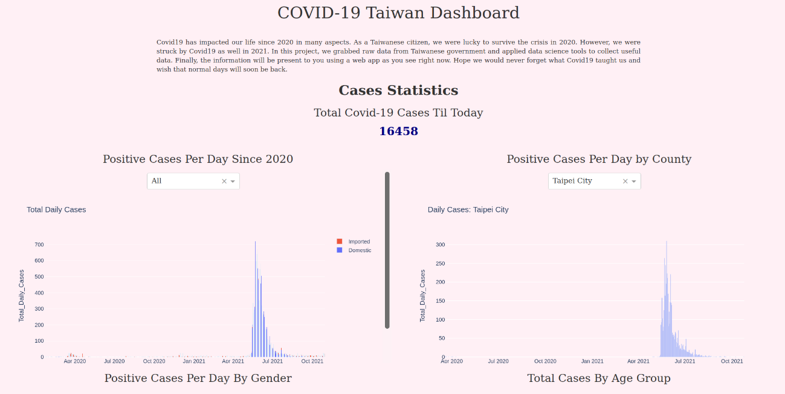

# Covid19_Django_Webapp
  
## Motivation
In our previous repo <a href='https://github.com/BurgerWu/airflow_covid19_tw'>airflow_covid19_tw</a>, we processed data acquired from Taiwanese Center of Disease Control(CDC) and National Center for High-performance Computing (NCHC) and stored it in MySQL database. But we want to do more than that. Therefore, in this project, we will visualized the data with the help of web development framework.

## Introduction
This repo is for the web deployment part of Covid19 dashboard project. You may check the airflow, that is, data acquisition and processing part, in another repo called <a href='https://github.com/BurgerWu/airflow_covid19_tw'>airflow_covid19_tw</a>. In this project, we would like to demonstrate the data we acquire from Taiwanese government using Django framework. This repo provides localhost version code, you are welcome to replicate the web page on your own host. In the late section, I will provide steps to local deployment.

## Packages Used
Some key packages and version are located within requirements.txt. Below shows critical packages and their function in this project
- **pandas**: For data processing
- **django**: Main framework module
- **pymysql**: Python module for MySQL connection
- **django_plotly_dash**: For interactive dash app integrated with django framework
- **plotly**: Main plotting package used in this plotly

## Files and Folder
### covid19_django_webapp
This folder contains system and administration settings file for the project. Most files are auto-generated while initiating the project. There are some key properties to modify in these files.
- urls.py: Assign url routing strategy, including path to admin page, path to static file and redirect to application page
- settings.py: This file stores settings for the project, including installed apps, databases, middleware, static url

### home
This is the application folder for app "home".
- **Dash Apps folder**: Contains dash plotly app codes for the template to reference for multiple selection interactive plots.
- **migrations folder**: Contains migration record of the project
- **static folder**: Storing static files (such as css, javascript and images) for the project. If you properly configure static path, Django with collect these static files for you when running server.
- **templates folder**: This is where the html template file lies
- **admin.py**: Register models and some other things (not used in this project)
- **apps.py**: Register your applicatiom config
- **db_connections**: Store connection parameters for other python files to reference
- **forms.py**: Create form class
- **models.py**: Create model class
- **urls.py**: Url routing strategy after redirecting to the application
- **utils.py**: Helper function referenced in views.py, mostly for plotting purpose
- **views.py**: Create views and context to return

### staticfiles
This folder contains staticfiles collected by Djangp server after running collectstatic command

### manage.py
This is the file you interact with Django with, you can assign different jobs by calling this file such as runserver, collectstatic, migrate, etc.

### requirements.txt
This file contains some key packages and their version used in this project you may use *pip install -r requirements.txt* in your environment to install packages

## Deploy Webapp Locally
### Prerequisites
There is some prerequisites as well as assumptions for deploying webapp locally:
- You have MySQL database installed and you already configure connections correctly (Database setting in settings.py and db_connections.py in home)
- You already have required data stored in MySQL. (If not, you may check instruction in this repo <a href='https://github.com/BurgerWu/airflow_covid19_tw'>airflow_covid19_tw</a> or visit <a href='https://www.kaggle.com/burgerwu/taiwan-covid19-dataset'>Kaggle</a> to download csv and import to MySQL directly) 
- You have install packages within requirements.txt (either by running *pip install -r requirements.txt* or manually)
- **You have created a database called "django_app" in MySQL that is used as database of this project**

### Steps
1. Git clone this repository to your computer
2. Redirect to directory containing manage.py
3. Run **python manage.py migrate** to initialize the database and settings
4. Run **python manage.py runserver** to start Django server, check if there is any problem with startup
5. Open your browser and visit localhost:8000 (my default port), if fortunate, you will see page like below

If not, you may debug from the error message or contact me if you want.

## Summary
We have successfully created a web page that visualized the covid19 related statistics of Taiwan. Furthermore, we have added some interactive features under the help of dash and plotly. If you are interested in how the data is acquired and processed, please visit another repository of mine <a href='https://github.com/BurgerWu/airflow_covid19_tw'>here</a>.

## Acknowledgement
Special thanks to Taiwan Center of Disease Control and National Center for High-performance Computing for providing high quality and reliable source data for this porject.

 
